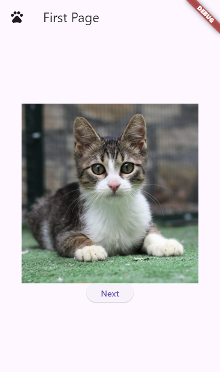
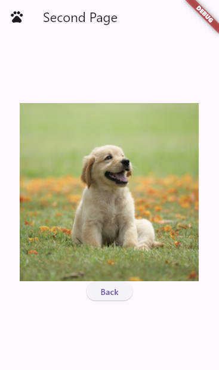
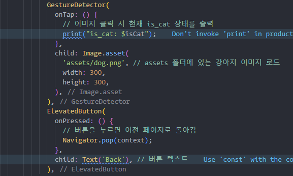
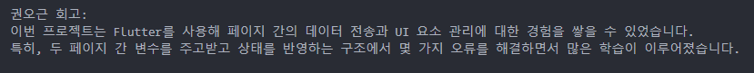
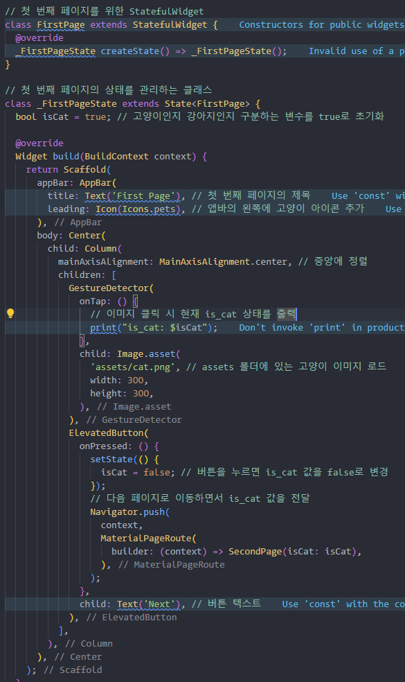

<aside>
🔑 **PRT(Peer Review Template)**

- [O]  **1. 주어진 문제를 해결하는 완성된 코드가 제출되었나요?**  
  

    전체적으로 문제가 요구하는 바는 충족했습니다.
    
- [O]  **2. 핵심적이거나 복잡하고 이해하기 어려운 부분에 작성된 설명을 보고 해당 코드가 잘 이해되었나요?**  

       코드를 이해하지 어렵지 않게 주석처리를 적절하게 하였음
- [X]  **3.** 에러가 난 부분을 디버깅하여 “문제를 해결한 기”을 남겼나요? 또는

       고양이 사진 누를 때 console창에 is_cat이 false로 출력되나 이 부분이 해결될 필요가 보임
        
- [O]  **4. 회고를 잘 작성했나요?**  

    데이터 전송부분에서 얻으신 점이 많은 것 같고 저 또한 위 코드를 참고하며 도움을 받았습니다.
 
- [O]  **5. 코드가 간결하고 효율적인가요?**  

    필요한 부분만 적절하게 활용해 반복된다는 생각없이 코드가 잘 이해되었습니다.

권오근 회고: 
이번 프로젝트는 Flutter를 사용해 페이지 간의 데이터 전송과 UI 요소 관리에 대한 경험을 쌓을 수 있었습니다.   
특히, 두 페이지 간 변수를 주고받고 상태를 반영하는 구조에서 몇 가지 오류를 해결하면서 많은 학습이 이루어졌습니다.  

조정민 회고 : 
해당 코드에서 에러가 발생했는데 어떠한 문제인지 파악하면서 해결할 수 있는 기회가 생긴것같아 완벽한 코드보다 저에게는 이런 코드가 더 좋다고 생각합니다.

</aside>
