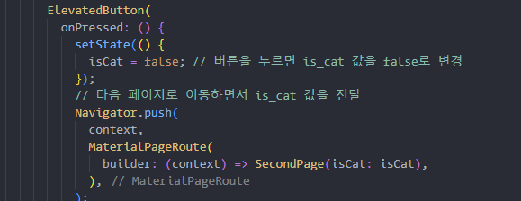

<aside>
🔑 **PRT(Peer Review Template)**

- [X]  **1. 주어진 문제를 해결하는 완성된 코드가 제출되었나요?**  
  

    - 문제에서 요구하는 기능이 정상적으로 작동하는지?
        - 해당 조건을 만족하는 부분의 코드 및 결과물을 근거로 첨부
    
- [X]  **2. 핵심적이거나 복잡하고 이해하기 어려운 부분에 작성된 설명을 보고 해당 코드가 잘 이해되었나요?**  

    - 해당 코드 블럭에 doc string/annotation/markdown이 달려 있는지 확인
    - 해당 코드가 무슨 기능을 하는지, 왜 그렇게 짜여진건지, 작동 메커니즘이 뭔지 기술.
    - 주석을 보고 코드 이해가 잘 되었는지 확인
        - 잘 작성되었다고 생각되는 부분을 근거로 첨부합니다.
        
- [ ]  **3.** 에러가 난 부분을 디버깅하여 “문제를 해결한 기”을 남겼나요? 또는

   “새로운 시도 및 추가 실험”을 해봤나요? ****
    - 문제 원인 및 해결 과정을 잘 기록하였는지 확인 또는
    - 문제에서 요구하는 조건에 더해 추가적으로 수행한 나만의 시도, 
    실험이 기록되어 있는지 확인
        - 잘 작성되었다고 생각되는 부분을 근거로 첨부합니다.
        
- [X]  **4. 회고를 잘 작성했나요?**  

    - 프로젝트 결과물에 대해 배운점과 아쉬운점, 느낀점 등이 상세히 기록 되어 있나요?

- [X]  **5. 코드가 간결하고 효율적인가요?**  

    - 코드 중복을 최소화하고 범용적으로 사용할 수 있도록 모듈화(함수화) 했는지
        - 잘 작성되었다고 생각되는 부분을 근거로 첨부합니다.

권오근 회고: 
이번 프로젝트는 Flutter를 사용해 페이지 간의 데이터 전송과 UI 요소 관리에 대한 경험을 쌓을 수 있었습니다.   
특히, 두 페이지 간 변수를 주고받고 상태를 반영하는 구조에서 몇 가지 오류를 해결하면서 많은 학습이 이루어졌습니다.  

</aside>