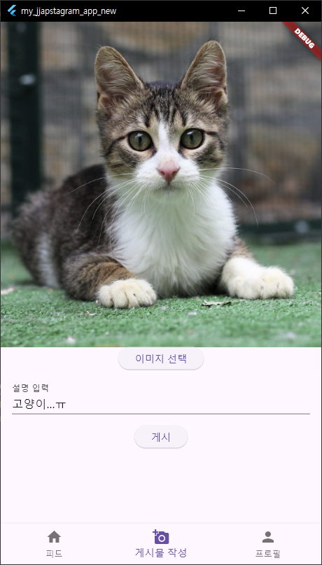
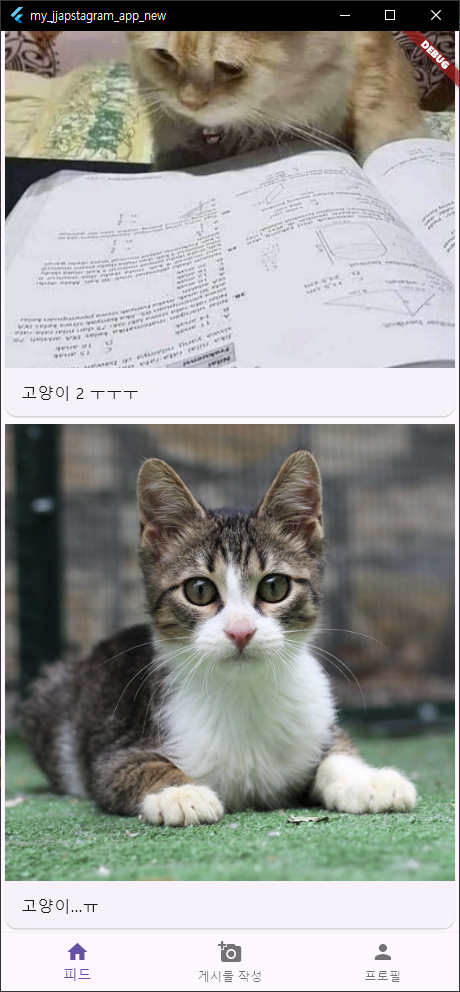
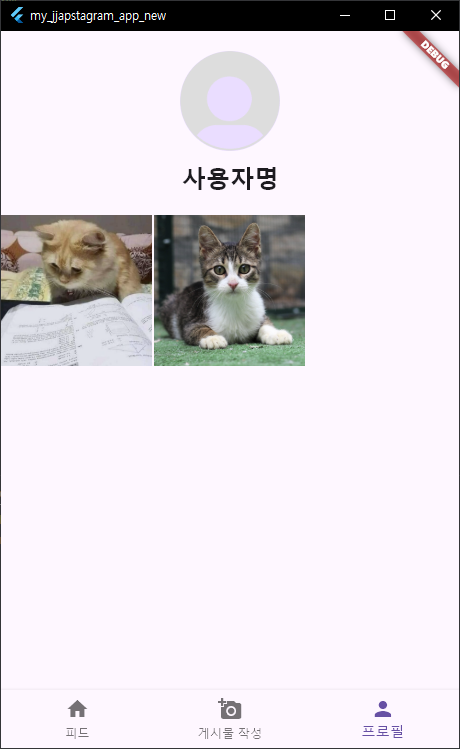

# AIFFEL_quest_cr

* AIFFEL 과정 중 진행하는 프로젝트, 피어리뷰를 관리하는 Repository입니다.
* 기본적인 틀을 제공하며, 파일이나 폴더를 수정/업로드하여 사용합니다.
* 주의: Flutter 프로젝트는 프로젝트 폴더를 업로드합니다.
---

짭스타 그램 만들기..  
일단 저는 인스타그램이랑 비슷한 앱을 만들어 보려고 했습니다.  
인스타그램이 생각보다 복잡한 앱이어서. 필수 기능인 피드, 업로드, 프로필 정도만 구현하려고 했습니다.  
Firebase를 서버로 채택해서 실제로 사용자가 사용할 수 있는 앱을 만들려고 했는데,  
너무나도 시행착오를 많이 겪으면서 ㅜㅠㅠㅠㅠ Firebase에 많은 시간을 빼았겨 버렸습니다.  
그래서 앱의 완성도가 떨어지게 되어서 너무나 아쉽습니다.  
AI 필터 적용을 탑재하려고 했는데, 그것도 모델 만들어놓고 시간이 없어서 적용까지는 못시켰네요.  
카메라 연동도 잘 안되는것 같고..  
그래도 나름 재미있었습니다. 새삼 앱을 만드는게 엄청 어렵구나 라는걸 많이 느낀것 같아요.  
프로젝트 제출은 이렇게 제출해야하겠지만,   제 나름 더 만져볼 생각입니다.  
언젠가 완성도 있는 앱을 배포해서, 사용자가 로그인하고 사용까지 할 수 있는 그런 앱을 만들어 보고싶네요.  
이번 프로젝트에서 그렇게 해볼려고 했는데, 처음 해보는거라 시행착오를 많이 겪었네요.  
한가지 배운건,  
앱 구축을 완성도 있게 다 만든 다음 서버 연동을 추가하는식으로 작업해봐야 겠어요.   
시작부터 서버와 함께 앱을 만들려니까. 너무 힘든것 같아요.  

  
~~~
my_jjapstagram_app/
├── lib/
│   ├── main.dart
│   ├── screens/
│   │   ├── home_screen.dart
│   │   ├── feed_screen.dart
│   │   ├── create_post_screen.dart
│   │   ├── profile_screen.dart
│   │   └── post.dart
├── assets/
│   └── default_profile_image.png
├── pubspec.yaml
~~~

