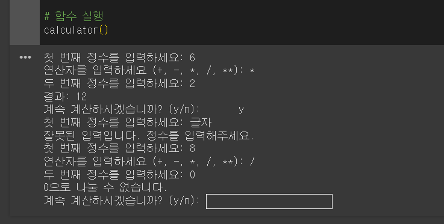

# AIFFEL Campus Online Code Peer Review Templete
- 코더 : 권오근
- 리뷰어 : 고은비

# PRT(Peer Review Template)
- [0]  **1. 주어진 문제를 해결하는 완성된 코드가 제출되었나요?**
    - 완성된 코드가 잘 제출되었습니다. 정수(0포함), 글자 등 다양하게 입력해 보았을 때, 결과값이 바르게 나오는 것을 확인할 수 있었습니다. 
        
         
    
- [0]  **2. 전체 코드에서 가장 핵심적이거나 가장 복잡하고 이해하기 어려운 부분에 작성된 
주석 또는 doc string을 보고 해당 코드가 잘 이해되었나요?**
    - 해당 코드에 대해 이해할 수 있도록 주석처리가 잘 되어있었습니다.
    - while문을 사용하여 간결한 코드로 작성되어 이해하기 쉬웠습니다.
        
- [V]  **3. 에러가 난 부분을 디버깅하여 문제를 해결한 기록을 남겼거나
새로운 시도 또는 추가 실험을 수행해봤나요?**
    - 디버깅한 시도가 직접적으로는 보이지 않는 것 같습니다.
    - 그러나 피어리뷰시 수행한 방법과 절차에 대해 설명해주셔서 이해할 수 있었습니다.

        
- [0]  **4. 회고를 잘 작성했나요?**
    - 네! 회고로 "재미있었다. 사용자가 못빠져나가게 묶어둘 수 있어서 좋았다."고 적어주셨는데요.
      (저와는 달리 퀘스트 문제를 수행하는 걸 즐기고 계신 것 같아서 너무 부러웠습니다^^)
        
- [0]  **5. 코드가 간결하고 효율적인가요?**
    - 코드가 간결하였으며, 다른 사람도 이해하기 쉽도록 잘 작성되었습니다.

# 회고
    
    고은비

   - 전체적으로 코드가 잘 작성되었다고 생각됩니다. 그리고 while문을 사용하여 쉽게 접근할 수 있도록 코드가 잘 짜여진 것 같습니다.
   - 수행한 코드에 대한 설명도 잘 하시고, 명확하게 문제를 파악하고 퀘스트를 진행하신 것 같습니다.
   - 페어 프로그래밍에 두 분이 각각 수행하신 경우는, 이전 퀘스트에서 못 보았었다보니 새로웠습니다.   
   - math 모듈을 import 하지 않아도, ** 계산이 된다는 걸 가르쳐주셔서 알게되는 시간이었습니다.
   - 위에 4번에도 적었지만, 퀘스트를 재미있었다고 느끼시는 오근님이 정말 부럽습니다~~ ^^*
   
   